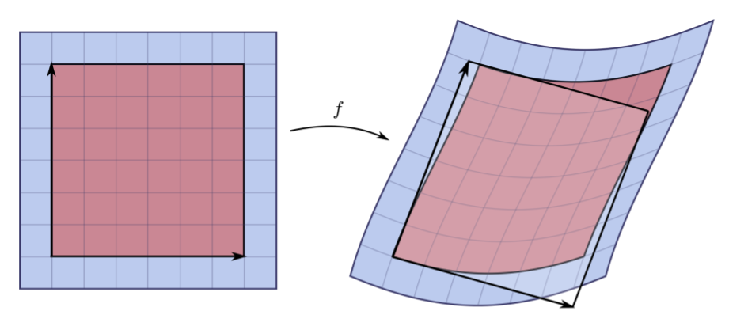

class: title-slide
count: True

# Unconstrained Monotonic Neural Networks
##### Accepted @ Neural Information Processing Systems 2019

.absolute.top.left.width-40[]
.absolute.top.right.width-15[]

*Benelearn 2019*

<table class="transparent">
<tr>
  <th>
 
</th><th>

</th>
</tr>
<tr>
  <th> Antoine Wehenkel</th><th>Gilles Louppe</th>
</tr>
</table>
---

# Density Estimation 👇

.center.grid[
.kol-5-12.width-70[]
.kol-2-12.width-100[   ]
.kol-5-12.width-70[]
]
> Density estimation aims at estimating the pdf of underlying data from an iid dataset.

## Applications:
- Model uncertainty.
- Out Of Distribution detection.
- Sampling.

---

class: left
# Change of Variables Theorem (1)
.top[> Given a random variable $\mathcal{Z}$ and a bijective function $f$, how does the density of $\mathcal{X} = f(\mathcal{Z})$ behave in terms of $p(\mathbf{z})$ and $f$?]

--
count: false

Assume $p(z)$ is a uniformely distributed unit cube in $\mathbb{R}^3$, and $\mathbf{x} = f(\mathbf{z}) = 2\mathbf{z}$.

.center.width-60[]

--
count: false

The total probability mass must be conserved, therefore $p(\mathbf{x}) = p(\mathbf{z}) \frac{V\_\mathbf{z}}{V_\mathbf{x}} = p(\mathbf{z}) \frac{1}{8},$
 where $ \frac{1}{8} = \left| \det \begin{pmatrix} 2 & 0 & 0 \\\\ 0 & 2 & 0 \\\\ 0 & 0 & 2 \end{pmatrix} \right|^{-1}$ is the determinant of the linear transformation $f$.

.footnote[https://joerihermans.com/talks/ffjord/]

---

class: left

# Change of Variables Theorem (2)
## What if the transformation is non linear?

.grid[
.kol-8-12[
- The Jacobian $J_f(\mathbf{z})$ of $f(\mathbf{z}) = \mathbf{x}$ represents the infinitesimal linear transformation in the neighbourhood of $\mathbf{z}$.
]
.kol-4-12.center.width-100[]
]

.footnote[https://www.lesswrong.com/posts/KKwv9kcQz29vqPLAD/a-primer-on-matrix-calculus-part-2-jacobians-and-other-fun]
--
count: false

- If the function is bijective map then the mass must be conserved locally.

Therefore, we can compute the local change of density as
$$ p(\mathbf{x}) = p(\mathbf{z}) \left| \det J_f(\mathbf{z})\right|^{-1}.$$

---
class: center

.top[# Change of Variables Theorem (3)]

.important[The combination of the right bijective map and any base distribution allows to represent any continuous random variable.]

--
count: false

.center[$ p(\mathbf{x}; \mathbf{\theta}) = p(\mathbf{z} = \mathbf{g}(\mathbf{x}; \mathbf{\theta})) \left| \det J_g(\mathbf{x}; \mathbf{\theta})\right|, \quad \mathbf{g}(.;  \mathbf{\theta})$ a neural network.]
.left[
- The bijective function takes in samples and maps them to noise.
- This process is refered as normalization if the noise distribution is normal.]
.grid[.kol-1-3.width-80[]
.kol-1-3.width-100.middle.center[
.grid[
.kol-3-12[]
.kol-1-2.width-50[]]
.grid[.kol-3-3.center[Density Estimation]]
]
.kol-1-3.width-80[]
]

---
class: center
count: false

.top[# Change of Variables Theorem (3)]

.important[The combination of the right bijective map and any base distribution allows to represent any continuous random variable.]

.grid[.kol-1-3.width-80[]
.kol-1-3.width-100.middle.center[
.grid[
.kol-3-12[]
.kol-1-2.width-50.horizontal-flip[]]
.grid[.kol-3-3.center[Sampling]]
]
.kol-1-3.width-80[]
]

.center[Once learned, the function can be inverted in order to generate samples.]

---

# Bijectivity with Neural Nets? 🤔
.grid[
.kol-1-1[
- $\begin{bmatrix}z\_1 & ... & z\_d\end{bmatrix} = g(\begin{bmatrix}x\_1 & ... & x\_d\end{bmatrix})$, $g$ can be a NN.
- $g$ is autoregressive if it can be decomposed as: $z\_i = g\_i(\begin{bmatrix}x\_1 & ... & x\_i\end{bmatrix})$
- If the $g\_i$ are invertible with respect to $x\_i \forall  i$, $g$ is bijective.
]
]

--
count: false

## The determinant of the Jacobian can be efficiently computed.
 The Jacobian of an autoregressive tranformation has the following form:
$$J\_F(\mathbf{x})  =
\begin{bmatrix}
\frac{\partial g\_1}{\partial x\_1} &  \frac{\partial g\_1}{\partial x\_2} & \frac{\partial g\_1}{\partial x\_3}\\\\
\frac{\partial g\_2}{\partial x\_1} &  \frac{\partial g\_2}{\partial x\_2} & \frac{\partial g\_2}{\partial x\_3}\\\\
\frac{\partial g\_3}{\partial x\_1} &  \frac{\partial g\_3}{\partial x\_2} & \frac{\partial g\_3}{\partial x\_3}
\end{bmatrix}
=
\begin{bmatrix}
\frac{\partial g\_1}{\partial x\_1} &  0 & 0\\\\
\frac{\partial g\_2}{\partial x\_1} &  \frac{\partial g\_2}{\partial x\_2} & 0\\\\
\frac{\partial g\_3}{\partial x\_1} &  \frac{\partial g\_3}{\partial x\_2} & \frac{\partial g\_3}{\partial x\_3}
\end{bmatrix}.$$

--
count: false

## Chain Rule

 An autoregressive density estimator learns the chain rule's factors:
$p(\mathbf{x}) = p(x\_1)\Pi^{d}\_{i=2}p(x\_i|x\_1,...,x\_{i-1}).$

---

#Example: Masked Autoregressive Networks
> Idea: Autoregessive Networks combined with linear transformations.

- $z\_1 = \sigma\_1 \times x\_1 + \mu\_1$
- $z\_i = \sigma\_i(x\_1, ..., x\_{i-1})\times x\_i + \mu\_i(x\_1, ..., x\_{i-1})$

--
count: false

## Invertible?
- $x\_1 = g^{-1}\_1(\begin{bmatrix}z\_1 & ... & z\_{d}\end{bmatrix}) = g^{-1}\_1(z\_1) = \frac{(z\_1 - \mu\_1)}{\sigma\_1}$
- $x\_i = \frac{z\_i - \mu\_i(\begin{bmatrix}x\_1 & ... & x\_{i-1}\end{bmatrix})}{\sigma\_i(\begin{bmatrix}x\_1 & ... & x\_{i-1}\end{bmatrix})}$
---
#Example: Masked Autoregressive Networks
> Idea: Autoregessive Networks combined with linear transformations.

But linear transformations are not very expressive:

.center[]

---
class: left
# Monotonic Transformations
How can we build a 1D invertible function? *Monotonic transformations.*
> How can we enforce the monotonicity of a function modeled by a neural network ?

.grid[
.kol-5-12.width-100[

]
.kol-7-12[
Possible solution:
Strictly positive weights and monotonic activation functions.

*But it restrains the architectural choice.*
]
]

---
count: false
# Monotonic Transformations
> How can we enforce the monotonicity of a function modeled by a neural network ?

Our solution: *To model and integrate the derivative.*

.grid[
.kol-4-12.width-100[

]
.kol-8-12[

The only constraint is on the output value which must be of constant sign (e.g. positive).

*This can be achieved by applying an exponential on the output neuron.*
]
]
.center.width-70[]

---

# Learning of UMNN 🤯
## How can we backward through the numerical integrator?
.grid[
.kol-8-12[
By keeping track of all the computations and building the corresponding computation graph.
]
]

---

# Learning of UMNN 🤯
## How can we backward through the numerical integrator?
.grid[
.kol-8-12[
By keeping track of all the computations and building the corresponding computation graph.
]
.kol-4-12[]
]

---

# Learning of UMNN 🤯
## How can we backward through the numerical integrator?
.grid[
.kol-8-12[
By thanking Leibnitz for his rule and applying it.
]
.kol-1-12[]
]

$
\frac{\mathrm{d}}{\mathrm{d} \omega}\left(\int^{b(\omega)}\_{a(\omega)}f(t; \omega) dt\right) = f(b(\omega); \omega) \frac{\mathrm{d}}{\mathrm{d} \omega}b(\omega) - f(a(\omega);\omega) \frac{\mathrm{d}}{\mathrm{d}\omega}a(\omega) + \int^{b(\omega)}_{a(\omega)} \frac{\partial}{\partial \omega}f(t; \omega) dt
$

.width-100[]

---
count: false

# Learning of UMNN 🤯
## How can we backward through the numerical integrator?
.grid[
.kol-8-12[
By thanking Leibnitz for his rule and applying it.
]
.kol-1-12[]
]

$
\frac{\mathrm{d}}{\mathrm{d} \omega}\left(\int^{b(\omega)}\_{a(\omega)}f(t; \omega) dt\right) = f(b(\omega); \omega) \frac{\mathrm{d}}{\mathrm{d} \omega}b(\omega) - f(a(\omega);\omega) \frac{\mathrm{d}}{\mathrm{d}\omega}a(\omega) + \int^{b(\omega)}_{a(\omega)} \frac{\partial}{\partial \omega}f(t; \omega) dt
$

.width-100[]

---

# Density Estimation with UMNN: UMNN-MAF
.center.width-100[]

--
count: false

> The Jacobian has the following form: $J\_F(\mathbf{x})  =
\begin{bmatrix}
\frac{\partial F\_1}{\partial x\_1} &  \frac{\partial F\_1}{\partial x\_2} & \frac{\partial F\_1}{\partial x\_3}\\\\
\frac{\partial F\_2}{\partial x\_1} &  \frac{\partial F\_2}{\partial x\_2} & \frac{\partial F\_2}{\partial x\_3}\\\\
\frac{\partial F\_3}{\partial x\_1} &  \frac{\partial F\_3}{\partial x\_2} & \frac{\partial F\_3}{\partial x\_3}
\end{bmatrix}
=\begin{bmatrix}
f\_1(x\_1) &  0 & 0\\\\
\frac{\partial F\_2}{\partial x\_1} &  f\_2(x\_2; x\_1) & 0\\\\
\frac{\partial F\_3}{\partial x\_1} &  \frac{\partial F\_3}{\partial x\_2} & f\_3(x\_3; x\_1, x\_2)
\end{bmatrix}$

---

# Experimental Results
.grid[
.kol-6-12.width-85[
## Toy Problems
.rotate-90[]]
.kol-6-12[
- Learnt by maximum likelihood on the train samples.
- Data dimensionality is $2$.
- Multimodality.
- Discontinuity.
]
]

---

# Experimental Results
.grid[
.kol-8-12.width-100[
## MNIST
]]
- Learnt by maximum likelihood on the training samples.
- Data dimensionality is $784$.
- Samples are generated by sampling noise and inverting the model.
- The model has no knowledge about the structure of the images,
i.e.: $p(\mathbf{x}) = p(x\_1,...,x\_{784}) = p(x\_1)\Pi\_{i=2}^{784} p(x\_i|x\_1,...,x\_{i-1})$

---

# Take Home Messages
- Any *monotonic function* can be modeled *by* a neural network that represents *the function derivative*.
- The Backward pass is *memory efficient thanks to the Leibnitz rule*.
- UMNN can be used as a building block of autoregressive bijective maps and provide a state of the art *density estimator*.

.grid[
.kol-8-12.width-100[]
.kol-4-12.width-75[]]
---
class: end-slide, center
count: false

Fin

---
count: false

# Experimental Results
.grid[
.kol-12-12.width-100[
## Density Estimation Benchmarks
]]
- Learnt by maximum likelihood on the training samples.

---
count: false

# Experimental Results
.grid[
.kol-12-12.width-100[
## Density Estimation Benchmarks
]]
- Learnt by maximum likelihood on the training samples.

---
count: false

# Experimental Results
.grid[
.kol-12-12.width-100[
## Density Estimation Benchmarks
]]
- Learnt by maximum likelihood on the training samples.

---
count: false
class: left

#UMNN to the rescue 🤯

.grid[
.kol-4-12.width-100[.left[## In Practice:]

   ]
.kol-1-12.width-100[]
.kol-7-12[A possible solution: to numerically approximate the derivative at each point.]
]

--
count: false

.grid[
.kol-4-12.width-100[]
.kol-1-12[]
.kol-7-12[A better solution: to integrate the model of the derivative.
$\hat{y} = \int^x_0\frac{\partial f(t)}{\partial t} dt + f(0)$
]
]
