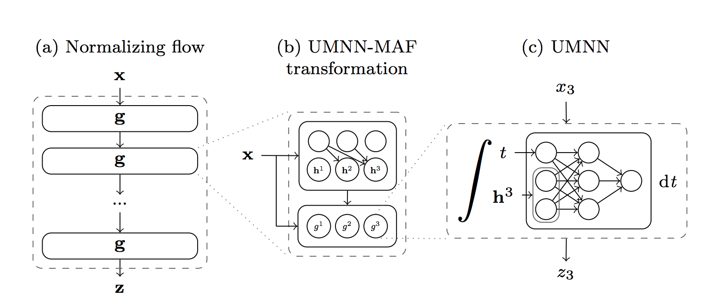
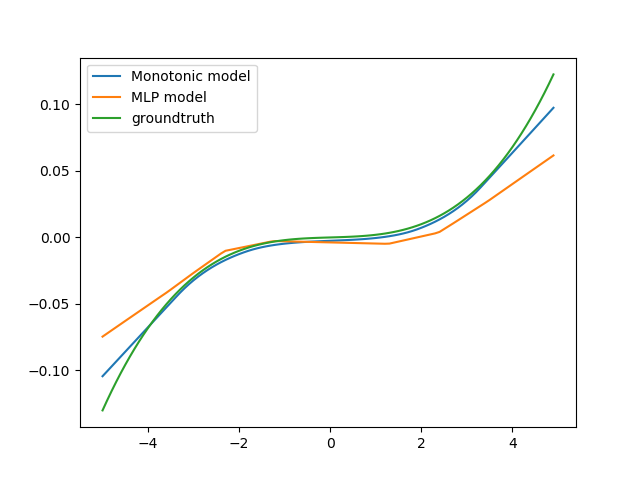
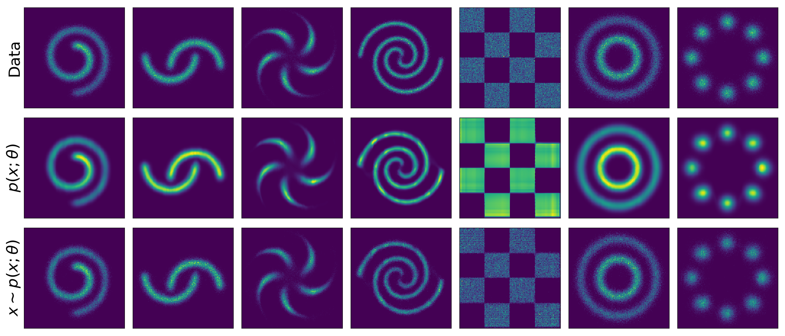
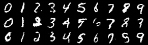

# Unconstrained Monotonic Neural Networks (UMNN)

Official implementation of Unconstrained Monotonic Neural Networks (UMNN) and the experiments presented in the paper:
> Antoine Wehenkel and Gilles Louppe. "Unconstrained Monotonic Neural Networks." (2019).
> [[arxiv]](https://arxiv.org/abs/1908.05164)

# Dependencies
The code has been tested with Pytorch 1.1 and Python3.6.
Some code to draw figures and load dataset are taken from 
[FFJORD](https://github.com/rtqichen/ffjord) 
and [Sylvester normalizing flows for variational inference](https://github.com/riannevdberg/sylvester-flows).

# Usage
## Simple Monotonic Function
This experiment is not described in the paper. We create the following dataset:
x = [x_1, x_2, x_3] is drawn from a multivariate Gaussian, y = 0.001(x_1^3 + x_1) + x_2 + sin(x_3). 
We suppose that we are given the information about the monotonicity of y with respect to x_1.
```bash
python MonotonicMLP.py 
```
In this experiment we show that a classical MLP won't be able to 
model a function that is monotonic with respect to x_1 because its effect is small
in comparison to the other variables. The UMNN performs better than an MLP while 
ensuring that the output is monotonic with respect to x_1.

## Toy Experiments

```bash
python ToyExperiments.py 
```
See ToyExperiments.py for optional arguments.
## MNIST

```bash
python MNISTExperiment.py
```
See MNISTExperiment.py for optional arguments.

## UCI Dataset
You have to download the datasets with the following command:
```bash
python datasets/download_datasets.py 
```
Then you can execute:
```bash
python UCIExperiments.py --data ['power', 'gas', 'hepmass', 'miniboone', 'bsds300']
```
See UCIExperiments.py for optional arguments.

## VAE
You have to download the datasets:
* MNIST: 
```
python datasets/download_datasets.py
```
* OMNIGLOT: the dataset can be downloaded from [link](https://github.com/yburda/iwae/blob/master/datasets/OMNIGLOT/chardata.mat);
* Caltech 101 Silhouettes: the dataset can be downloaded from [link](https://people.cs.umass.edu/~marlin/data/caltech101_silhouettes_28_split1.mat).
* Frey Faces: the dataset can be downloaded from [link](https://github.com/y0ast/Variational-Autoencoder/blob/master/freyfaces.pkl).
```bash
python TrainVaeFlow.py -d ['mnist', 'freyfaces', 'omniglot', 'caltech']
```

## Other Usage
All the files related to the implementation of UMNN (Conditionner network, Integrand Network and Integral)
are located in the folder models/UMNN. 
- `NeuralIntegral.py` computes the integral of a neural network
(with 1d output) using the Clenshaw-Curtis(CC) quadrature, it computes sequentially the different evaluation points required by CC.
- `ParallelNeuralIntegral.py` processes all the evaluation points at once making the computation almost as fast as the forward evaluation 
the net but to the price of a higher memory cost. 
- `UMNNMAF.py` contains the implementation of the different networks required by UMNN.
- `UMNNMAFFlow.py` contains the implementation of flows made of UMNNs.
- Check [here](https://github.com/AWehenkel/generalized-UMNN/) if you are interested by modeling functions that are monotonic with respect to more than one input variable. (Do not hesitate to contact me for more details)

## Cite

If you make use of this code in your own work, please cite our paper:

```
@inproceedings{wehenkel2019unconstrained,
  title={Unconstrained monotonic neural networks},
  author={Wehenkel, Antoine and Louppe, Gilles},
  booktitle={Advances in Neural Information Processing Systems},
  pages={1543--1553},
  year={2019}
}
```
